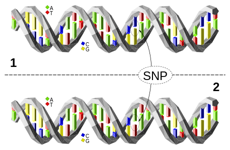

---
output:
  word_document: default
  html_document: default
---
# Introduction {#intro}
\pagenumbering{arabic}
\setcounter{page}{1}

## Background

<p> There are several techniques used for studying genetics and mapping the results.  Some of the more popular techniques include cross-breeding experiments or, in the case of  humans, the examination of family histories, known as pedigrees. More recently, CRISPR/Cas9 can be used to mimic mitotic recombination to help map out genes as well. (\cite{sadhu2016crispr}) </p>

<p> Construction of genetic maps are a variety of techniques used to show relative positions between genes or other sequence features of the genome and the phenotype that is controlled by such sequences. Genes are very useful markers but they are by no means ideal. One problem, especially with larger genomes such as those of vertebrates and flowering plants, is that a map based entirely on genes is not very detailed.(\cite{brown2006genomes}) Genes have long areas of non-coding regions between them and therefore result in large gaps from gene to gene.  This is further complicated because not every gene has allelic forms that can be easily or conveniently distinguished.  With these considerations in mind gene maps may not be comprehensive enough and other markers may be needed. </p>

<p> According to brown, mapped features that are not genes are called DNA markers. As with gene markers, a DNA marker must have at least two alleles to be useful. There are three types of DNA sequence feature that satisfy this requirement: restriction fragment length polymorphisms (RFLPs), simple sequence length polymorphisms (SSLPs), and single nucleotide polymorphisms (SNPs). (\cite{brown2006genomes})  The genetic markers that have been emphasized in this work are single nucleotide polymorphisms.  Attempting to be at the highest levels of resolution for identifying quantitative traits, using SNPs are the most specific case.  This will give exact location of the nucleotide that may be impacting the genetic control over the phenotype. </p>

```{r Snp-Pic, fig.cap='SNP Picture', out.width='80%', fig.asp=.75, fig.align='center', echo = FALSE}

```

<p> There are several goals to genetic mapping and association studies that identify certain regions of the genome that contain genes involved in specifying a quantitative trait, referred to as quantitative trait loci (QTLs).  One main goal is to estimate the genetic effects of these loci. The relationship between the genetic effects of QTLs and the phenotypic value of quantitative traits can be described by a linear model (\cite{collard2005introduction}, \cite{xu2007empirical}). Typically, because of the high throughput nature of the data there are a large number of markers across the whole genome, and most of the markers may have very little or next no effect on the phenotype under study. The models can be very sparse, with most cases, the number of genetic markers or variables is bigger than the sample size, especially when interactions among markers are considered. This makes a model is over saturated and further model selection techniques may be required to capture the necessary information. \cite{dong2015accurate} </p>

```{r system-map, fig.cap='Systems Map', out.width='80%', fig.asp=.75, fig.align='center', echo = FALSE}

```

## Some Exisiting Methods

<p> Numerous methods exist and are being developed to measure and find quantitative trait loci (QTL) effects.  These methods can broadly fall into three main categories.  These categories are Least-Square methods, maximum likelihood and Bayesian approaches.  (\cite{wu2007statistical})  Each method has advantages and considerations that you would need to be aware before conducting analyses to find QTL effects from the given markers.  A brief discussions on a few of the methods are given to highlight some areas of consideration and how the methods proposed can handle such considerations. </p>

<p> Marker Regression would fall in the category of Least Squares approaches.  If looking at one marker analysis general t-test and ANOVA procedures can be used to analyze the relationship.  It is not recommended however for use in general practice because you do not know how dense the markers are measured.  QTL interval mapping would be preferred in such an analysis because the methods take account for missing genotype data that may not have been measured.  When estimating a QTL position through maximum likelihood methods, like interval mapping, positions of other possible QTLs could affect the detection of the true position.  Neighboring QTLs could possibly flatten the likelihood in instances where there are multiple QTLs on the same chromosome. This would make an effect look less significant at a given location than it actually is.  Another possibility is that in the search over the interval you may find an area where the likelihood could reach a peak but could be a “ghost” QTL.  This is where an effect is observed because a neighboring QTL is skewing the results at the particular position you are looking in and the result is a false discovery of the position.  Marker Regression has been shown to improve interval mapping, which is call Composite Interval Mapping.  This is where the QTL position found is also combined in a linear regression where the covariates are the other markers in the dataset.  By including the markers as covariates the other position in the chromosome are accounted for in the analysis and false discovery is reduced.  </p>

<p> The analysis of interval mapping and single marker analyses has shown to be effective but it limits our inference to one marker at a time as a possible loci that controls a trait.   Using Marker Regression however you can incorporate multiple markers in a single analysis to test for possible QTL for a given trait.  It is cautioned that running such an analysis is only an approximate test because the null hypothesis is there is no difference between the marker levels and therefore a non-mixture distribution but the alternative is a mixture of distributions.  The assumptions regression would make of the errors within the marker type to be normally distributed may not be entirely met if the QTL’s fall between the marker regions.  However \cite{whittaker1996mapping} have shown that a direct regression of phenotypes on marker types, provides the same information about location of QTL-effects without having to step to all positions on the interval.  With this information using the entire marker set in a regression analysis would provide a nice, computationally efficient way to map out the genetic architecture of a trait. </p>

##	Chapter Overview

<p> The main theme of this paper is to propose an improvements on selection procedures which use regression techniques to approach high dimensional variable selection such as the ones arising in epistatic analysis.  The variable selection procedure for QTL mapping can be seen as one of deciding which subset of variables have effects on the phenotypes of interest, and identifying those specific traits out of all possible effects between the markers.  Each procedure proposed is a forward selecting method that starts with the empty set.  After starting with the empty set each procedure continues to add markers to the model set as possible QTLs.  Once a designated stopping criteria is met the final model is fit and the effects are estimated. Each of the next three chapters focuses on a new selection procedure and the properties of them.  </p>

### HighDeQTL

<p> In this chapter we introduce the iform procedure, originally proposed by (\cite{hao2014interaction}).  Included in the chapter is the algorithm and how it compares to forward selection.  From there it is adapted to use for a genetic mapping studies.  The properties of this will be explored in detail.  Simulation studies were conducted to assess how well the properties are met and under what conditions.  Comparisons to other models was also explored to get a sense of the utility and advantages that come with the new selection procedure.  After the comparisons and simulations a real world application is performed.  The application was a reanalysis of a data set using C Elegans first proposed by \cite{rockman2010selection}. </p>

### Higher Order Epistasis

<p> The next chapter considers higher order epistasis and its importance. Currently it is under studied because of practical limitations not because of biological limitations or relevance.  The iFORM procedure proposed in Chapter 2 is then extended to incorporate higher orders of epistatic effects.  Even though similar methods are being used the properties are still studied and assessed.  Simulation studies were performed to assess practical applications.  Several scenarios and comparison models were considered to extensively look at what properties were being met and which were not.  Then an application to Mei tree growth was conducted in order to see the real world application of such a selection procedure.  Different growth parameters were previously fit and these were used as the phenotype.  Interesting and more predictive implications came out of the model when considering higher order epistasis throughout the selection procedure.  </p>

### iForm Funcional Mapping

<p> The application of the Mei tree growth led into exploring to use a more functional phenotype as a response throughout the selection procedure.  In order to use all relevant information of the repeated measure data, it would take an additional computation burden to the selection and the modeling but it would also give more power and flexibility to the modeling that would not be present otherwise.  It is important to use all relevant information in order to make the most accurate prediction about the data.  Using a growth curve model to assist in fitting the data would help ease some of the computational burden.  The selection of genetic effects however would be very simplistic as some additive shift to the curve.  This view may not be the most accurate and therefore more complicated structures will be implemented to produce better results. Legendre orthogonal polynomials were considered to model the genetic effects.  These polynomials have various forms and would allow for the genetic effect to follow different patterns but also not induce unnecessary correlation between predictors when included in the model. Again, simulation studies were conducted and a reanalysis of the full Mei tree dataset was considered.  </p>

### Conclusions

<p> Finally in the last chapter it will focus on comparisons and discussion around the models proposed.  Future aims of the research goals will be explored also.  Seeing how my current research will lead into the aims and what possible directions can be explored with the given statistical frameworks. </p>

