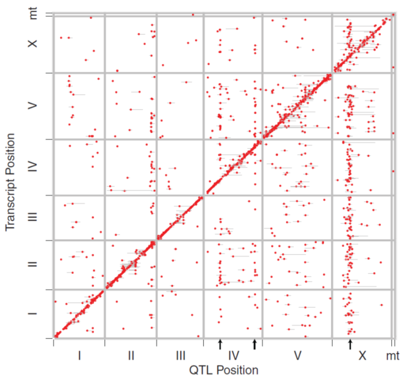
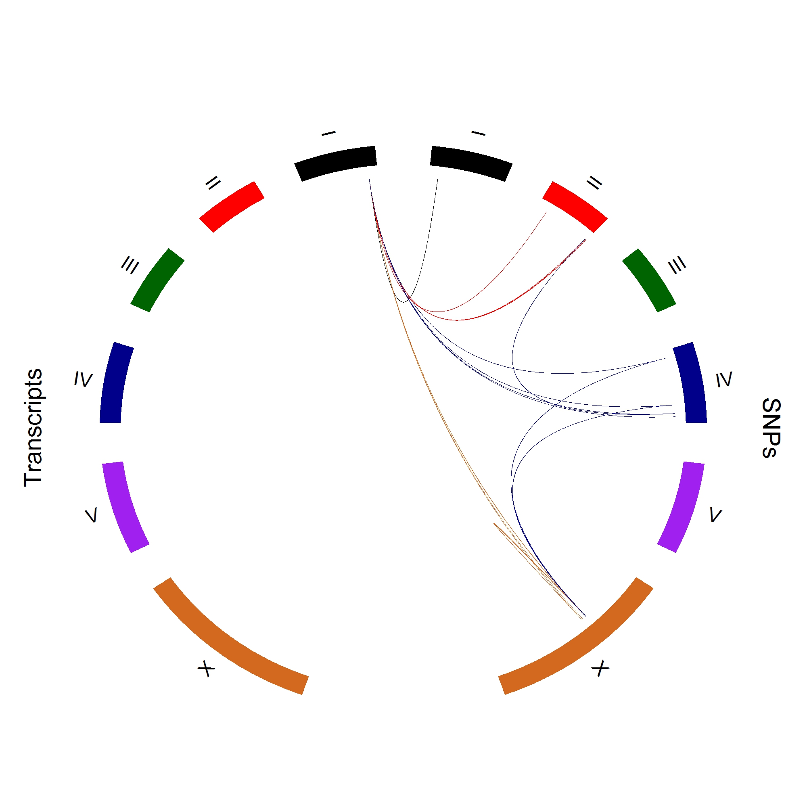

# High Dimensional eQTL {#highdeqtl}

## Motivation

<p> Since activation or inhibition of gene expression causes change in phenotypic formation, the identification of expression quantitative trait loci (eQTLs) that regulate the pattern of gene expression is essential for constructing a precise genotype-phenotype map (\cite{emilsson2008genetics}; \cite{cookson2009mapping}; \cite{nica2013expression}).  With the advent and development of various biotechnologies, it has become possible that genome-scale marker and expression data can be generated, providing an important fuel to systematically study the biological function of any types of cellular components in an organism (\cite{kim2014meta}; \cite{fairfax2014innate}; \cite{lee2014common}). Several genome-wide association studies (GWAS) have been initiated to map a complete set of eQTLs for the abundance of genome-wide transcripts whose expression levels are related to  biological or clinical traits (\cite{nica2013expression};\cite{li2013using}; \cite{koopmann2014genome}). Statistical analysis and modeling are playing an increasing role in mapping and identifying the underlying eQTLs from massive amounts of observed data (\cite{kendziorski2006statistical}; \cite{chun2009expression}; \cite{sun2012statistical}; \cite{flutre2013statistical}). </p>

<p> A typical eQTL mapping approach is to associate a gene transcript with a single marker such as single nucleotide polymorphism (SNP). By analyzing the significance of all these markers one by one adjusted for multiple testing, one can count significant loci that contribute to variation of expression by the gene. This marginal approach based on a simple regression model has been instrumental for the identification of eQTLs in a variety of organisms (\cite{rockman2010selection}; \cite{kim2014meta}). However, there are two major limitations for the results by such a marginal analysis: First, it does not take into account the dependence of different markers, thus a significant association detected by one marker may be due to the other markers that are linked with it. The marginal marker analysis cannot separate the confounding effect of eQTLs due to marker-marker dependence or linkage (\cite{wu2007statistical}). Second, an eQTL may act through its interaction with other eQTLs and environmental factors. Because of their paramount importance in affecting complex diseases and traits, gene-gene interactions, or epistatic effects, and gene-environment interactions have been studied intensively in modern biological and medical research (\cite{cheverud1995epistasis}; \cite{moore2003ubiquitous}; \cite{van2010detection}; \cite{mackay2014epistasis}) </p>

<p> These two limitations can be overcome by analyzing all markers and their pairwise interactions simultaneously through formulating a high-dimensional regression model. Although it can infer a complete picture of the genetic architecture of gene expression, this endeavor is highly challenged by the curse of dimensionality, i.e., the number of predictors far exceeds the number of observations. The past decade has witnessed the tremendous development of variable selection models for high-dimensional data analysis, such as LASSO (\cite{tibshirani1996regression}), SCAD (\cite{fan2001variable}), Dantzig selector (\cite{candes2007dantzig}), elastic net (\cite{zhao2006model}), minimax concave penalty (MCP) (\cite{zhang2010nearly}) among others. Many methods possess favorable theoretical properties such as model selection consistency (\cite{zhao2006model}) and oracle properties (Fan and Lv 2011). When the number of predictors is much larger than the number of observation, sure screening is a more realistic goal to achieve than oracle properties or selection consistency (\cite{fan2008sure}; \cite{wang2009forward}). Sure screening assures that all important variables are identified with a probability tending to one, hence achieving effective dimension reduction without information loss and providing a reasonable starting point for low-dimensional methods to be applied. </p>

<p> More recently, Hao and Zhang (\cite{hao2014interaction}) extended variable selection approaches to jointly model main and interaction effects from high-dimensional data. Based on a greedy forward approach, their model can identify all possible interaction effects through two algorithms iFORT and iFORM which have been proved to possess sure screening property in an ultrahigh-dimensional setting. In this article, we implement and reform Hao and Zhang’s model to map the genetic architecture of eQTL actions and interactions for gene expression profiles. This model is modified to accommodate to the feature of a genetic mapping or GWAS design in which molecular markers as genetic predictors are discrete although some additional continuous predictors can also be considered. We expand Hao and Zhang’s regression model to include discrete components. Also, for an F2 or a natural population with three genotypes at each locus, we need to estimate a total of eight genetic effects for a pair of markers, which are additive and dominant effects at each locus, and additive x additive, additive x dominant, dominant x additive and dominant x dominant effects between the two loci (\cite{kempthorne1968correlation}). Thus, if the number of markers is p, a total number of predictors including all main and two-way interaction terms is $2p^2$. For a typical moderate-sized mapping study, in which several thousands of markers are genotyped on a few hundred individuals, consideration of pair-wise genetic interactions will quickly make the dimension of predictors an ultrahigh one. </p>

<p> By modeling all markers jointly at one time under an organizing framework, the modified model can detect all possible significant eQTLs and their epistasis. An eQTL can be either a cis-QTL, coming from the same physical location as the gene expression, or a trans-QTL, coming from other areas of the genome. Our model can more precisely discern these two different types of eQTLs and their interactions than traditional marginal analysis. By reanalyzing a published data collected in a mapping population of C. elegans (\cite{rockman2010selection}), the new model has validated previous results by the marginal approach, meanwhile obtained new discoveries on the genetic origin of gene expression differentiation, which could not be detected in a traditional way. </p>


## Methods

### Experimental design

<p> Consider an experimental population for genetic studies of complex traits, such as the backcross and F2 initiated from two inbred lines, full-sib family derived from two outcrossing parents, or random samples drawn from a natural population. These types of populations are used specifically for different species. Although they have different levels of complexities for statistical modeling, the genetic dissection of different populations underlies a similar principle. For the purpose of simplicity, we consider a backcross design in which there are only two genotypes at each marker. </p>

<p> Suppose the backcross contains n progeny, each of which is genotyped by p markers, such as single nucleotide polymorphisms (SNPs), distributed over different chromosomes. The number of SNPs p should be large enough to completely cover the entire genome at an adequate depth so that we can possibly capture all possible genetic variants. An increasing body of evidence suggests that significant SNPs associated with complex traits or diseases are more likely to be eQTLs (\cite{li2013using}). Hence the identification of eQTLs is an important first step toward the genetic dissection of end-point phenotypes. For this reason, we assume that genome-wide gene transcripts have been available for the assumed study population. Assume that all progeny are recorded for the same organ by microarray, leading to expression abundance data of m gene transcripts. We purport to identify all possible genetic variants including main effects and interaction effects of SNPs that contribute to each gene transcript. </p>


### Adaptation of iFORM procedure

<p> Hao and Zhang \cite{hao2014interaction} formulated an interaction forward selecting procedure under the marginality principle (iFORM).  The marker and gene transcript data of the study population can be denoted as $(X_i,Y_i) (i = 1,\dots, n)$ which are independent and identically distributed copies of (X,Y), where $X = (X_1,\dots,X_p )^T$ is a p-dimensional predictor vector and Y is the response, expressed by a linear regression model:  

\begin{equation}
Y = \beta_0 + \beta_1 X_1 + ⋯ + \beta_p X_p + \epsilon
(\#eq:lin-mod)
\end{equation}

The $\beta$’s are the coefficients for the genetic effects of each marker. Like most genome-wide datasets, the number of markers here grossly outnumbers the number of observations, $p >> n$.  Therefore, selection procedures would need to be implemented in order to fit a linear regression model such as \@ref(eq:lin-mod).  We are already at the point of high-dimensional data but if we want to include epistatic effects between different markers as predictors as well it would increase the amount of predictors by $(p^2+p)/2$ .  The resulting linear model would grow to be,

\begin{equation}
Y = \beta_0 + \beta_1 X_1 + \dots + \beta_p X_p + \gamma_{11} X_1^2 +\gamma_{12} {X_1}{X_2} + \dots + \gamma_{pp} X_p^2 + \epsilon
(\#eq:lin-mod2)
\end{equation}

where $\gamma$’s are the coefficients for the epistatic effects for all the quadratic and two-way interactions between the markers.  For convenience we will assume that the markers and the transcripts are standardized before running the selection procedure. Therefore, $E(X_ij )=0$, $Var(X_ij )=1$, $E(Y_i )=0$ and $Var(Y_i )=1$ for $i=1,\dots,n$; $j=1,\dots,p$.  Also, the quadratic and two-way interaction effects will be centered which we will write as $Z_i=(\dots,X_{ik} X_{il}-E(X_{ik} X_{il} ),\dots)^T$.  By doing so we would eliminate the need for an intercept in regression model \@ref(eq:lin-mod2). This would reduce the model to the form,

\begin{equation}
Y = X^T \beta + Z^T \gamma
(\#eq:lin-mod3)
\end{equation}

Some notations that will be used to define the elements of \cite{hao2014interaction} iFORM procedure are as follows.  
$P_1 = {1,2,\dots,p}$   $P_2 = {(k,l):1 \le k \le l \le p}$.
which are the index sets for the linear and two-way interactions terms, respectively.  The significant main effects for the markers and their interaction effects are
$T_1 = {j:\beta_j \ne 0,j\in P_1},T_2 = {(j,k):\beta_{jk} \ne 0,(j,k) \in P_2}$.
For any model M, |M| will be used to denote the number of predictors contained in the model.  The true model size would be indicated by $|T_1| = p_0$  and $|T_2| = q_0$ or together would be |T|=d_0=p_0+q_0. For the procedure, three sets will be used throughout. The sets are M for the model set, C for the candidate set of predictors and S for the solution set of predictors currently selected in the model. </p>

<p> There are two principles that are used in the selection procedure when considering interactions as candidates for selection into the final model.  The first is considering the principle of marginality. The principle states that it is inappropriate to model interaction terms when the main effects contributing to the interaction have either not been included in the model or are deleted because their effects become marginal by the inclusion of the interaction effect. The second principle important to the procedure is the heredity principle. The strong case of the principle states that an interaction effect should not be considered unless both the contributing main effects are in the model (\cite{zhao2006model}). This would translate to 
$\gamma_{jk} ≠ 0 only if  \beta_j, \beta_k \ne 0 \forall 1 ≤ j, k ≤ p$
for model (\@ref(eq:lin-mod2)). By including both principles during the selection process it allows for dynamically including both main effects and interactions effects. The interaction effects can only be considered between the main effects currently selected into the solution set of the model according the discussed principles. A more formal description of the procedure is given below. </p>


### iFORM

<p> \cite{hao2014interaction} formulated an interaction forward selecting procedure under the marginality principle (iFORM). The procedure’s initial step starts with the empty set for both the solution set and the model set, $S_0=\emptyset$ and $M_0=\emptyset$. The candidate set contains all main effects at the beginning, $C_0 = P_1$, for each of the markers as a possible eQTL. Typical forward selection procedures are carried out to start the selection. Each marker is tested individually using a marker regression. The marker that results in the lowest residual sum of squares is the marker selected from the candidate set into the solution set as an eQTL. This is then iterated again for a selection of another marker into the model set. Once there are at least two main effects selected into the solution set, using the strong heredity principle, the quadratic and two-way interactions are then created and placed into the candidate set as possible eQTLs for selection in the next step. This process continues selecting main effects or the newly created interaction effects into the solution set. If another main effect is selected into the solution set, then the candidate set grows with the creation of all possible two-way interactions of the main effects that are currently in the solution set. This is continued until a designated stopping value, say d. For the number of predictors placed into the model set from the solution set the Bayesian information Criterion was used, $BIC_2(\hat{M})=log(\hat \sigma \hat M)+n^{-1} |\hat M|\star(log(n)+2\star log(d^\star))$, where $\sigma^2 \hat{M}$ is the sample variance for the given model, $|\hat{M}|$ is the size of the model or the number of predictors selected into the given model, and n is the sample size. The $d^*$ term is the number of predictors in the full model. This was proposed as $BIC_2$ by \cite{chen2008extended} which they derived to help control the false discovery rate in high dimensional data situations. They also showed that it was selection consistent if $d^\star = O(n^\xi)$  for some $\xi \gt 0$.  The only difference between the traditional $BIC$ calculation and the $BIC_2$ is the additional term involving $2log(d*)$.  Ignoring the $BIC$, the most the number of steps in the solution path is of size n. The parameter d controls the overall length of the solution path. In practice, the exact number of predictors to include, say $d_0$, in the true model is unknown. We want to make d large enough to include d_0 but not so large as to fit the model to the point where it becomes over saturated. Using the $BIC_2$ should help avoid such a matter as well. It is reasonable to assume that $d_0$ is much smaller than n in high dimensional sparse regression problems (\cite{fan2008sure}). Since this is the case, for the purposes of our model, d was set to be no larger than $n/log(n)$. Generally, the $BIC_2$ should reach minimum, indicating the optimal stopping point, before the designated stopping value, is reached. </p>

### Some considerations

<p> There were some considerations and pre-processing steps taken before the iFORM procedure was implemented. The first consideration was to see if there were any exact duplicate markers in the dataset. One drawback that could arise with marker datasets when attempting to run multiple linear regression is the possibility of duplicate markers in the dataset. If two different markers would happen to have exactly the same genotypes for each subject it would show up as an exact linear combination of each other if both markers were to be placed in the linear model. Including redundant markers in a linear model would not add any additional information and therefore should not be included in the candidate set during the selection procedure. This also reduces the dimension slightly when there are duplicate markers in the dataset. </p> 

<p> Another consideration made is the type of coding used for the genotypes. At any given eQTL, the jth eQTL, say, there are two possible genotypes: Q_j Q_j and Q_j q_j, making the total number of possible QTL genotypes in the population 2^m. The goal of a genetic model is to relate the 2^m possible genotypic values to a set of genetic parameters, such that these parameters are interpretable in terms of main and epistatic effects of the m eQTL. A genetic model is to use orthogonal contrast scales because it is consistent in the sense that the effect of a eQTL is consistently defined whether the genetic model includes one, two, three, or more eQTL (\cite{kao2002modeling}). The orthogonal contrasts for the genetic model can be expressed by $$x_{ij} = \left[\frac{-1}{2} if homozygote Q_j Q_j, \frac{-1}{2} if heterozygote Q_j q_j \right]$$ Typically in an inbred line backcross population a given genotype is coded with a 0 and 1.  However there are two draws backs to this coding when considering the selection procedures discussed above. The first issue comes with not including an intercept in model (\@ref(eq:lin-mod2)). If this is the case each of the predictors would need to be centered making the coding to $-\frac{1}{2}$  and $\frac{1}{2}$  instead of 0 and 1. Besides meeting the assumptions of the model that the predictors are centered, it is also beneficial for the interaction effects as well. If the coding would remain at 0’s and 1’s, the interaction coding would also consist of 0’s and 1’s.  This could propose a problem because three out of the four scenarios of epistasis between markers would result in a coding of 0 for the level in the interaction effect. This has the potential to falsely skew the data of no additive effect for interactions terms because of the sparseness of coding. By centering the coding to $(-\frac{1}{2},\frac{1}{2})$, it would result in an interaction effect being coded as $(-\frac{1}{4},\frac{1}{4})$. This coding would happen for different scenarios for each of the levels. The $-\frac{1}{4}$ could arise when the interaction is made up of a homozygote interacting with a heterozygote genotype. A coding of $\frac{1}{4}$ would arise by either a homozygote interacting with another homozygote genotype, or when a heterozygote interacts with another heterozygote genotype. </p>  


## Application

### Simulation Results

Simulations studies were conducted to test the theoretical properties of the selection procedures and the results \@ref(tab:sim1), \@ref(tab:sim2) and \@ref(tab:sim3).  The results were compared to several other commonly used methods for eQTL mapping. In each of the examples the response was generated from model (2) with σ=1,2,and 3 for the random error with a sample size of $n=200$. The $X_i$'s were all independently and identically distributed realizations generated from $Binomial(0.5)$ and then orthogonal contrasts were made making each $x_ij\in (-\frac{1}{2}, \frac{1}{2})$.  The true $\beta=(3,0,0,3,0,3,3,0_{493})$, therefore making $T_1={1,4,6,7}$ and $p_0=4$.  The relevant interactions were set to the pairs $\mathcal{T}_2={(1,6),(1,7),(4,7),(4,7)}$ and $q_0=4$ all with $γ_jk=3$ where $(j,k) \in \mathcal{T}_2$.  There were several methods compared during each of the simulations \@ref(tab:sim1), \@ref(tab:sim2) and \@ref(tab:sim3). The methods that were used to model the data were single marker analysis, forward selection involving only main effects (FS), forward selection involving all main effects and interaction (FS2) and the iFORM procedure.  Several outcomes were evaluated to compare across each of the models.  The outcomes are separated into three parts.  The first part focuses on the selection of main effects, the second part focuses on the selection of interaction effects and the third part is the overall model performance. Simulations of M=100 replicates were run and the outcomes considered include

*Convergence Probability (Cov) $\Sigma_{m=1}^MI(\mathcal{T} \subset \hat{\mathcal{T}})/M$
*Percentage of correct zeros (Cor0) $\Sigma_{m=1}^M\Sigma_{j=1}^pI((\hat{\beta_j}=0,\beta_j=0)/[M(p-p_0)]$
*Percentage of incorrect zeros (Inc0) $\Sigma_{m=1}^M\Sigma_{j=1}^p I(\hat{\beta_j}=0,\beta_j \ne 0)/[M(p_0)]$
*Exact Selection probability (Exact) $\Sigma_{m=1}^M I(\mathcal{T}=\hat{\mathcal{T}})/M$
*The average model size
*Mean Square Error (MSE)
*Adjusted R-square 
*Computation Time in seconds


In each instance of the simulation, the iFORM procedure was closest to the simulated data, indicated as Oracle. Single marker analysis was conducted on each of the main effects individually and the significant markers were then designated as eQTLs. When comparing the single marker analysis, we can see it rarely designated the full set of main effects as significant from the simulated data. Also, no consideration for interactions could be assessed in single marker analysis. The iFORM procedure contains the identified main effects over 90% of the time across all simulations. The procedure also includes interaction selection. The interaction screening shares a similar success rate where the interaction effects are correctly selected over 90% of the time as well. Focusing on the computation time, we observed only a few seconds, on average, increase than running single marker analysis. The final models selected by the iFORM procedure had similar adjusted R-square values as the Oracle results, on average.  Looking at the exact selection percentage, we can see that the vast majority of the time the correct predictors were selected and indicated as significant each time. To compare the interaction screening effectiveness, forward selection was implemented on both the main effects and interactions effects. The time it took to create the design matrix in order to implement forward selection was not included in the computation time.  As can be seen from the results, using forward selection on the full set of main effects and pair-wise interactions took substantially longer to run on average than any of the other methods, including the iFORM procedure. Another drawback to implementing forward selection on such a large set seemed to come with over fitting the model. The selection included the maximum number of predictors allowed by the designated stopping value and did not use the BIC criteria for final model selection. This resulted in 19 additional predictors selected \@ref(tab:sim1), \@ref(tab:sim2) and \@ref(tab:sim3). This increased the adjusted R-square value of the final model, however this is suspected because of over fitting the data and not to be a true prediction of the response. 

**runs off the page**

```{r sim1, tidy=FALSE, echo = FALSE}
knitr::kable(
  read.csv("Chapter02_Table1Sim1.csv"), caption = 'Simulation 1 Table (sigma=1)',
  booktabs = TRUE
)
```


```{r sim2, tidy=FALSE, echo = FALSE}
knitr::kable(
  read.csv("Chapter02_Table1Sim2.csv"), caption = 'Simulation 2 Table (sigma=2)',
  booktabs = TRUE
)
```


```{r sim3, tidy=FALSE, echo = FALSE}
knitr::kable(
  read.csv("Chapter02_Table1Sim3.csv"), caption = 'Simulation 3 Table (sigma=3)',
  booktabs = TRUE
)
```

### Real Data Analysis

\cite{rockman2010selection} reported an eQTL mapping study of C. elegans using 208 recombinant inbred advanced intercross lines (RIAIL) from a cross between the laboratory strain, N2, and a wild isolate from Hawaii, CB4856. Abundances of 20,000 gene transcripts were measured by microarray in developmentally synchronized young adult hermaphrodites of these lines, providing a genome-wide coverage of C. elegans from WormBase, a public C. elegans genome database. The microarray data was preprocessed through a normal–exponential convolution background correction and normalized using quantile standardization. Although they are closely related, the two strains used for the cross are considered relatively divergent for C. elegans. The two strains differ roughly at approximately 1 base pair per 900.  Their RIAILs were genotyped at 1454 ordered single-nucleotide polymorphism (SNP) markers that cover the whole genome of C. elegans including five autosomes (denoted as I – V) and one sex chromosome (denoted as X).

\cite{rockman2010selection} used a classic interval mapping approach to detect 2309 eQTLs by testing and scanning associations of each SNP with each gene transcript over the entire genome. Rockman et al’s analysis allowed a rectangular map of eQTL positions gene positions to be constructed \@ref(fig:RockmanPic) , from which one can identify cis-eQTLs on the diagonal and trans-eQTLs off the diagonal. However, because their association analysis was conducted individually for each SNP, the detection of eQTLs was based on the marginal effects of individual eQTLs, which may lead to two issues being unsolved. First, of those eQTLs detected for the same gene transcript, some may include confounded effects by others. Second, the effects of genetic epistasis may take place but were not detected. By analyzing all SNPs simultaneously under a single framework, the high-dimensional model, iFORM, implemented in this study can more precisely characterize the genetic machinery underlying variation in each gene transcript. More specifically, we treat each transcript as a response with all SNP markers and their interactions as predictors by building a big regression model. Significant predictors were then selected based on the iFORM procedure. A final model including both main and interaction effects can be evaluated by calculating adjusted R-square values


```{r RockmanPic, fig.cap='SNP Picture', out.width='250px', out.height='250px', fig.align='center', echo = FALSE}

```


\@ref(fig:ChromosomePic) illustrates the map of how a particular gene transcript is controlled by its eQTLs through main effects and interaction effects. For clarity of our presentation, we only chose one representative gene transcript from each chromosome. For example, gene transcript A_12_P103290 located at position 2069088 – 2069147 of chromosome I was detected to be controlled by main effects due to X2_13516256 eQTLs on chromosomes II and X4_15632637 eQTLs on chromosome IV and X2_13516256:X4_15632637 interactions between some of these eQTLs on these two chromosomes. 

```{r ChromosomePic, fig.cap='SNP Picture', out.width='250px', out.height='250px', fig.align='center', echo = FALSE}

```

iFORM provides the estimates of each effect (either main effect or interaction effect), standard errors of each estimate and the significance tests of each effect. As an example, \@ref(tab:OutputTable) gives the result of how gene transcript A_12_P103290 can be predicted by its eQTLs and their interactions. It can be seen that the final predictive model (adjusted $R^2 = 0.896$) contains 14 markers which exert their main effects and/or interaction effects on the transcript. Of the 14 final markers, a half shows significant main effects (p < 0.05), with several (i.e., X_14636404, X4_15568674, X4_15632637 and X_14542103) explaining about 5% heritability (defined as a proportion of genetic variance due to a predictor over the total phenotypic variance). Of these final markers, we identified eight significant epistatic interactions. Each epistasis accounts for 4.6 – 5.5% heritability \@ref(tab:OutputTable).

```{r OutputTable, tidy=FALSE}
knitr::kable(
  list(
    read.csv("OutputTable1.csv"),
    read.csv("OutputTable2.csv")
  ),
  caption = "iFORM         Single Marker Analysis",
  booktabs = TRUE
)
```

It is interesting to note that all predictors jointly contribute to 62.6% heritability for transcript A_12_P103290, of which main effects account for 26.7% and epistatic effects account for 35.9%. It is very surprising that epistasis contributes to more than a half of heritability. Of the eight epistatic interactions, only one occurs due to the interaction between two significant eQTLs, X_14542103 and X4_13532205 \@ref(tab:OutputTable). All the remaining is due to interactions between one significant eQTL and one non-significant marker. Some eQTLs, such as X_14542103 and X_14636404, produce epistasis with a greater frequency than others. Despite their involvement in the final predictive model, some markers were tested to be insignificant in terms of both main and interaction effects, suggesting that they regulate a gene transcript in a subtle but important fashion. In summary, iFORM can not only provide an estimate of the overall heritability of gene transcript A_12_P103290 (i.e., the sum of individual heritabilities explained by each predictor), but also chart a detailed picture of how each genetic variant contributes to transcript variation. In particular, iFORM can characterize epistasis and its role in trait control, thus equipped with a capacity to retrieve so-called missing heritabilities (\cite{manolio2009finding}), a significant issue arising from current genome-wide association studies.

Through analyzing associations between all markers and each transcript by iFORM, we can identify the difference of cis- and trans-eQTLs for a particular transcript. For example, of the eQTLs affecting A_12_P103290, we detected that X1_2068168 is a cis-eQTL, whereas all others are trans-eQTLs \@ref(tab:OutputTable). We list the number and distribution of these two types of eQTLs and the pattern of how they interact with each other to determine gene transcripts \@ref(tab:Table5). By detecting cis-eQTLs and trans-eQTLs, iFORM detected that genetic interactions take place mostly between trans-eQTLs.

```{r Table5, tidy=FALSE}
knitr::kable(
  read.csv("Chapter02_OutputTable_cisQTL.csv"), 
  caption = "Distribution of cisQTLs",
  booktabs = TRUE
)
```

## Discussion

<p> With the recent development of genotyping and sequencing techniques, the collection of genome-wide genetic and genomic data from any tissue of an organism has been made much easier and more efficient. Because of this, genetic studies of complex diseases or traits have developed during the past decade to a point at which we can draw a complete picture of genetic architecture for disease or trait formation and progression by genome-wide association studies (GWAS) (\cite{mackay2009genetics}. Traditional marginal analysis based on simple regression has been instrumental for the detection of important genetic variants or quantitative trait loci in a variety of organisms, but its bottleneck has emerged quickly due to its limitation in precisely and comprehensively charting genetic control landscapes. Many GWAS studies published are bothered by missing heritabilities because of their incapacity to detect genome-wide epistasis and genotype  environment interactions (\cite{manolio2009finding}). </p>

<p> Epistasis is a phenomenon by which the influence of a gene on the phenotype depends critically upon the context provided by other genes (\cite{cheverud1995epistasis}). It has been increasingly recognized that epistasis is an important source for trait variation (\cite{moore2003ubiquitous}; \cite{carlborg2004epistasis}; \cite{cordell2009detecting}), thus inclusion of epistasis would enhance the prediction accuracy of phenotypic performance and shed more light on the global genetic architecture of trait control (\cite{mackay2014epistasis}). However, epistasis is extremely hard to detect as an interaction term, whose inclusion may complicate the inference of the predictive model (\cite{carlborg2004epistasis}; \cite{mackay2014epistasis}). Thanks to recent progresses in high-dimensional data modeling, we have been able to implement several cutting-edge statistical models for systematical detection and characterization of genome-wide epistasis. </p>

<p> \cite{hao2014interaction} proposed a new high-dimensional model, iFORM, that can tackle an issue of interaction selection simultaneously from a large pool of continuous predictors. This model is based on forward-selection-based procedures, characteristic of computational feasibility and efficiency. The authors further proved that the detection of interactions by iFORM is consistent, even if the dimension increases exponentially for a sample size. As one of the first attempts to introduce high-dimensional models into genetic studies, we modified iFORM to accommodate to the discrete nature of molecular markers. Our simulation studies indicate that iFORM can provide reasonably accurate and precise estimates of genetic main effect and interaction effects. Also, it shows greater power to detect significant genes and their interactions which may not be detected by traditional single marker analysis. </p>

<p> We applied iFORM to re-analyze gene expression data in an eQTL mapping study (\cite{rockman2010selection}). While our results confirmed those by the traditional approach, the new model provides some new findings including new eQTLs and epistasis, thus allowing a complete set of genetic variants to be characterized. As an important tool to understand the genetic mechanisms underlying both complex traits and diseases, eQTL mapping has been widely used to identify key regulatory pathways toward endophenotype and end-point phenotypes (\cite{schadt2005integrative}; \cite{emilsson2008genetics}; \cite{cookson2009mapping}; \cite{pickrell2010understanding}; \cite{nica2013expression}). A typical eQTL study may not only include a large number of molecular markers as like in a GWAS, but also record tens of thousands of gene transcripts throughout the entire genome. Our current version of iFORM can only take into account one gene transcript as a response at a time, thus having a limitation to model the correlation and dependence among different genes. It is our next step to formulate a multivariate multiple regression model by which to test how an individual predictor, main effect or epistatic effect, pleiotropically affects correlated expression profiles of different genes. </p>

<p> Given the complexity of biological phenomena, pair-wise epistasis may be insufficient to explain phenotypic variation. \cite{imielinski2008exploiting} argued that high-order interactions among more than two genes may provide a key pathway toward complex traits. Three-way interactions have been detected in trait control (\cite{mcmullen1998quantitative}; \cite{stich2007power}). A model for modeling three-way interactions has been developed in a case-control GWAS design (\cite{wang2010general}) and a genetic mapping setting (\cite{pang2013statistical}). It is crucial to extend iFORM to map main effect, two-way epistasis and three-way epistasis in an eQTL mapping study although no substantial change is needed in the computational algorithm, except for an enlarged test set and extra computing time. Our work is based on a backcross population in which there are only two genotypes at a locus. The backcross population can facilitate our estimation and test of genetic effects owing to a smaller number of parameters at each locus or locus pair, but its utility is very limited in the F2 design of model systems and natural populations of outcrossing species such as humans. A more general model of iFORM should consider three genotypes at each locus, which provides estimates of additive and dominant effects at each locus and four types of epistasis, i.e., additive x additive, additive x dominant, dominant x additive and dominant x dominant, between each pair of loci (\cite{kempthorne1968correlation}). Each of these epistatic types may affect a phenotype through a different pathway.</p>

<p> With continuous falling of sequencing price, we will have desirable opportunities to study the dynamic behavior and pattern of gene expression profiles across time and space scales (\cite{vinuela2010genome}; \cite{ackermann2013impact}). Many previous studies suggest that gene expression during cell and organ development may follow a particular form, which can be quantified by mathematical equations (\cite{kim2010wavelet}). For example, abundance of gene expression may change periodically in human’s brain during circadian clock. Many researchers used Fourier’s series approximation to model the periodic changes of gene expression by estimating the period and amplitude of the cycles (\cite{li2013using}). By integrating Fourier series into iFORM, we will be able to map dynamic eQTLs for gene expression and make a quantitative prediction of temporal and spatial patterns of genetic control by eQTLs. </p>
