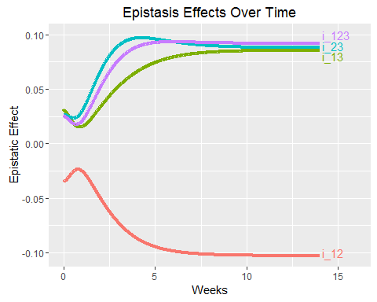

# High-order Epistatic Networks {#highorder}

## Motivation

<p> Quantitative traits are very difficult to study because these traits are controlled by many genes that interact in a complicated way (\cite{nelson2013century}; \cite{mackay2014epistasis}). Genome-wide mapping and association studies increasingly available due to next-generation high-throughput genotyping techniques have proven to be useful for characterizing gene-gene interactions, coined epistasis, that contribute to phenotypic variation (\cite{cordell2009detecting}; \cite{van2011travelling}; \cite{wei2014detecting}). Powerful statistical methods have been developed to analyze all possible markers simultaneously, from which to search for a complete set of epistasis for quantitative traits (\cite{li2014fast}; \cite{gosik2016iform}). The joint analysis of all markers is particularly needed to chart an overall picture of genetic interactions, in comparison with computationally less expensive marginal analysis. </p>

<p> Epistasis reported in the current literature is mostly due to interactions between two genes. However, a growing body of evidence shows that genetic interactions involving more than two loci play a pivotal role in regulating the genetic variation of traits (\cite{wang2010general}; \cite{dowell2010genotype}; \cite{pang2013statistical}; \cite{taylor2014genetic}). For example, in a mapping population deriving from crossing two chicken lines, three-locus interactions were detected to determine body weight (\cite{pettersson2011replication}). A mapping study established by two yeast strains identified genetic interactions involving five or more loci for colony morphology (\cite{taylor2014genetic}). Other studies have demonstrated that high-order epistasis is of critical importance in regulating metabolic networks in yeast (\cite{weinreich2013should}) and Escherichia coli and Saccharomyces cerevisiae (\cite{imielinski2008exploiting}; \cite{he2010prevalent}), whereas lower-order (pairwise) epistasis may be insufficient to explain metabolic variation for these organisms. </p>

<p> The theoretical models of high-order epistasis have well been established by mathematical biologists (\cite{hansen2001epistasis}; \cite{beerenwinkel2007analysis}). These models provided a foundation to interpret high-order epistasis from a biological standpoint. A few statistical models have been derived to estimate and test high-order epistasis in case-control designs (\cite{wang2015bayesian}) and population-based mapping settings (\cite{pang2013statistical}). \cite{wang2015bayesian} developed a Bayesian version of detecting high-order interactions for both continuous and discrete phenotypes. However, these models were based on a marginal analysis, thus less powerful to illustrate a global view of genetic control mechanisms due to high-order epistasis. </p>

<p> In this article, we deploy a variable selection procedure within a genetic mapping or association setting to characterize the genetic architecture of complex traits composed of main effects of individual genes, pairwise epistasis between two genes, and three-way epistasis among three genes. The model was built on greedy interaction screening forward selection developed under the marginality principle (named iFORM) by \cite{hao2014interaction}. These approaches, proved to possess sure screening property for ultrahigh-dimensional modeling, have been implemented to model the genetic architecture of main effects and pairwise epistasis due to eQTLs for gene transcripts (\cite{gosik2016iform}). Here, we extend the implementation of iFORM to systematically capture three-way interactions that are expressed among all possible markers studied. To show the statistical power of the extended model, we performed computer simulation studies. The model was further validated through analyzing a real data of genetic mapping for shoot growth in a woody plant, mei (Prunus mume). The model should be used in any other mapping or association studies of quantitative traits. </p>

## Methods

### Mapping and association studies

Genetic mapping and association studies are two types of designs used to dissect quantitative traits. The former is based on a controlled cross derived from distinct parents, whereas the latter samples different genotypes from a pool of accessions or a natural population. In both types of design, a set of individuals are sampled to be phenotyped for quantitative traits of interest and genotyped by molecular markers distributed throughout the entire genome. For a particular genetic experiment, the number of markers is much larger than that of samples, thus, it is impossible to estimate the genetic effects of all markers simultaneously using traditional regression models. This issue becomes much intractable when we aim to estimate genetic interactions of different orders. To tackle the issue of the number of predictors >> the number of samples, several variable selection approaches have been implemented in association studies. One approach is forward selection which was shown to be robust for estimating pairwise interactions of predictors (\cite{hao2014interaction}). With sure screening properties and controlling for false positives, this approach, named iFORM, performs very well in capturing important information in explaining the response variable. On top of these nice theoretical properties it is computationally efficient by using ordinary least squares calculations and only requiring a predetermined set up steps. Here, we extended the iForm procedure to include HGI’s to capture more relevant information.  In the following sections, the notation and model set-up will be introduced.  After this theoretical properties will be explored.  Finally simulated and real data analysis will be conducted to help confirm the theoretical properties and show the feasibility of using the model for screening across whole genomes to more precisely explain phenotypes of interest.  

### Epistatic model

Consider a linear model that underlies the true genotype-phenotype relationship.  Assume that the phenotype, as the response of the model, is controlled by a set of p SNPs that act singly and/or interact with each other. These main and interaction effects of markers, i.e., the predictors of the model, need to be estimated. Let $\mathbf{Y}=(y_1,\dots, y_n)^T$ denote the phenotypic value of n samples from a mapping or association population. When considering pairwise and three-way interactions, the linear model is expressed as

\begin{equation}
\mathbf{Y}=\alpha + X^T\beta + Z^T\gamma + W^T\eta + \epsilon
(\#eq:lin-mod)
\end{equation}

where $X=(X_1,\dots,X_p)^T$ is the design matrix that specifies the genetic effects of each marker $\beta=(\beta_1,\dots,\beta_p,~ Z=(X_jX_k)^T (1 \le j \le k \le p)$ is the design matrix that specifies the epistatic effects between two markers, expressed in  $\gamma, W=(X_j X_k X_l)^T  (1 \le j \le k \le l \le p)$ is the design matrix that specifies the epistatic effects among three markers, expressed in $\eta$, and $\epsilon ~ N(0,\sigma^2 )$ is the residual error normally distributed with mean zero and variance $\sigma^2$.
We denote the index sets for the linear, order-2 and order-3 effects in equation \@ref(eq:lin-mod), respectively, as
$P_1={1,2,\dots,p}$
$P_2={(j,k):1 \le j \le k \le p}$
$P_3={(j,k,l):1 \le j \le k \le l \le p}$
With the significant main, order-2 interaction and order-3 interaction effect sets being,
$T_1={j:\beta_j \ne 0,j \in P_1}$
$T_2={(j,k):\gamma_{jk} \ne 0,(j,k) \in P_2}$
$T_3={(j,k,l):\eta_{jkl} \ne 0,(j,k,l) \in P_3}$

The true size of $\mathcal{T}_1$, will be $p_1$ and similarly for $\mathcal{T}_2$  and $\mathcal{T}_3$ will have sizes $p_2$  and $p_3$ respectively. There will be a total of 3 sets referred to throughout the procedure, the candidate set $\mathcal{C}$, the selection set $\mathcal{S}$ and the model set, $\mathcal{M}$. The candidate set is the set of all possible predictors at a given step in the selection process. The selection set contains the predictors that have previously been selected from the candidate set from each iteration of the procedure. Finally, the model set is the final model that is fit from the selection set at the end of the procedure.  The BIC is used to determine the optimal cutoff for the final model size. 

### iForm with high-order epistasis

The iForm procedure is a forward selecting procedure.  In traditional forward selection the procedure starts with the empty set and then iterates through the entire set of possible predictors in $\mathcal{C}$ and selects the best predictor and includes it in S at the end of each step. The best predictor can be determined in many ways but usually is defined by the predictor that results in the least amount of error.  For our purposes we use the residual sum of squares.  This continues with selecting the best predictor from C at each step until a designated stopping criterion is met or until some information criterion is met.  Common information criteria used for selecting predictors to be in $\mathcal{M}$ are AIC, BIC, $R^2$ and Mallow’s $C_p$ statistic.  

The iForm procedure for high-order epistatic detection parallels the forward selection procedure, but C will grow dynamically with the creation of order-2 and order-3 interaction effects between main effects that were included from previous iterations of the procedure.  There are three steps to the model selection.  The first step is to initialize the 3 sets mentioned above.  The sets, $\mathcal{S}$ and $\mathcal{M}$ are set to the empty set while the candidate set, $\mathcal{C}$, is first set to $P_1$, all the main effects.  The next step starts the forward selection procedure selecting predictors from $\mathcal{C}$.  The selected predictor will be a main effect at the first step. At subsequent steps, after interaction effects are included, selected predictors could be either be a main effect, order-two or order-three interaction effect.  The final step involves repeating the second step until a designated stopping criterion is met.  This can be a certain amount of predictors to be considered in the final model, or it can be based off of other factors such as the sample size. The designated stopping criterion will be denoted as d.  For our purposes we use d as a function of the sample size, $d = n/log_2a(n)$. The procedure will run up until d iterations, and the optimal model will then be constructed from the selection set. This is done by an information criterion. Here we used the Bayesian Information Criterion proposed by \cite{chen2008extended} denoted as the $BIC_2$. This was derived by them to control the false discovery rate in high dimensional model selections. 

\begin{equation}
BIC_2(\hat{M}) = log(\hat{\sigma_M}^2) + n^{-1} |\hat{M}|*(log(n)+2*log(d^{\star}))
(\#eq:bic2)
\end{equation}

Once the selection procedure is done and there are d predictors in the selection set the BIC is used to determine the cutoff value for the optimum number of predictors in the model set.  Then linear regression is performed on the model set.

Two guiding principles are used to help dynamically select the main effects and epistasis effects throughout the procedure.  The first is the marginality principle, which states that an effect will not be removed from the model once it has been selected.  A previous selected effect may become marginal by the inclusion of subsequent effects.  This especially can be the case when an interaction effect is included.  One of the parent effects may become less significant or even not significant at all by considering both in the model.  The next principle we state as the heredity principle but has also been referred to in other work as the hierarchy principle (\cite{bien2013lasso} and \cite{lim2015learning}).  There are two cases of the heredity principle considered.  The strong case would not allow for an order-2 epistasis effect to be included into the candidate set without both the parent main effects that make up the interaction are first included in the model.  More formally this can be written as, $\gamma_{jk} \ne 0$ only if  $/beta_j ,\beta_k \ne 0 ~\forall~ 1 \le j, k \le p$.  Similarly with order-3 epistasis, you would need to have all order-2 epistatic parent effects included in the model before including as a candidate predictor.  This would translate to, $\eta_{jkl} \ne 0$ only if  $\gamma_{jk},\gamma_{jl},/gamma_{kl} \ne 0~\forall~ 1 \le j,k,l \le p$.  The weak case relaxes the need for all parent effects to be included in the model before considering the epistatic effects as candidates.  Only one parent effect would be required to be in the model for candidates to be included.  In the scenario with order-2 epistatic effects we would need, $\gamma_{jk} \ne 0$ only if  $\beta_j^2+,\beta_k^2 \ne 0~ \forall~ 1 \le j, k \le p$ and with order-3 epistatic effects to be considered as a candidate we would need, $\eta_{jkl} \ne 0$ only if  $\gamma_{jk}^2+\beta_l^2 \ne 0~\forall~ 1 \le j, k, l \le p$.

The heredity (hierarchy) principle help reduce the search space by making the assumption that previously selected main effects would be involved in the interaction effects.  By considering this principle it substantially reduces the search space making this feasible for ultra-high dimensional situations.  Even larger than ram datasets can be used with efficient memory mapping of the dataset while running the procedure. The weak version of the heredity principle for three-way interactions states that at least one of the main effects needs to be selected into the model to consider an interaction effect that contains that predictor. Considering a moderately high set of predictors say p = 5000, if trying to include all order-2 interactions upfront, will make the candidate set be as high as 12,498,000.  This alone could exceed most ram requirements of standard computers. This is before even stepping up to order-3 interactions.  The weak heredity principle would decrease the candidate set substantially. Assuming a sample size of $n = 200$, would give a cut off of $n/log_{2}(n) = 200/log_{2}(200) = 26$ steps in the procedure.  The 5000 original predictors plus up to 5000 epistatic predictors included in the candidate set at each step in the procedure would give a maximum of approximately 135,000 candidate predictors.  This would give a maximum of approximately 135,000 candidate predictors.  This gives a 100 fold decrease in the candidate set. This could substantially make ultra-high dimensional analysis more feasible and also speed it up in the process. This is the weak case. If considering the strong case the decrease in candidate space is even more apparent. Aside from the efficiency by lowering the search space of the candidate set, the heredity principle is usually taken into account by researchers when selecting models involving the consideration for interaction effects.

### Theoretical Properties 

The theoretical properties of the iForm procedure with high-order epistasis follow closely with the forward selection procedure. \cite{hao2014interaction} summarize forward selection nicely as follows.  At each step, the response is regressed on the most correlated covariate, and the residual is calculated and used as the new response in next step. After the most correlated covariate (say, $X_1$) is selected, all other covariates are regressed on $X_1$, and then the covariates are substituted by the corresponding normalized residuals, which are used as the new covariates in next step. By viewing forward selection in this sense the computational complexity of the procedure depends upon the size of the candidate set. The candidate set in the iForm’s case does grow dynamically at each step, by at most the number of predictors currently selected in C for each step. If we denote the current size of the candidate set as m then each iteration of the procedure grows with complexity of O(nm), where n is the sample size. Leaving the selection unrestricted we would not be able to fit more than n predictors for a linear model and therefore n would be the most main effects that would be able to be selected. Considering the weakest form of the heredity principle at the current iteration there would be at most $p + (n(n-1)(n-2))/6$ predictors in the candidate set. This would make the total complexity of the selection procedure to be $nO(n(p+n(n-1)(n-2))) = O(n^3 p+n^5)$. This makes the total complexity grow linearly as p grows.

The theoretical properties of the iForm procedure show sure screening properties (\cite{fan2008sure}). By this we mean that all the import predictors, whether that is a main effect or epistatic effect will be selected with probability tending to 1. This is important to capture as much of the signal as possible through all the noise that comes with $p >> n$ or ultra-high dimensional situations. It is also important not to ‘over-fit’ the model with unnecessary predictors that actually explain more noise in the data that the model is being fitted on than the actual signal you would like to pick up on. 

To show the property from above the following conditions would need to be met for regulatory purposes.  \cite{hao2014interaction} showed how under these conditions sure screening properties for interaction models like FS2 and iForm are satisfied.  This also applies to order-3 interaction models like FS3 and iForm with higher order epistasis, like we do with the high-order epistasis model.  The following assumptions need to be met for these conditions. The first is that the $X=(X_1,\dots,X_p)^T$ are jointly and marginally normal with independent normally distributed error.  Next we would need the eigenvalues of the covariance matrix to be positive and bounded by two constants $0 < \tau_min < 1 < \tau_{max} < \infty$, such that $\sqrt{\tau}_min < \lambda_min (\Sigma)≤\lambda_max (\Sigma)< \sqrt{\tau}_max/4$.  Also, the genetic effects, $\beta$ need a certain level of signal strength.  This we would assume to be $|(|\beta|)| ≤ C_\beta$ for some positive constant $C_\beta$  and $\beta_min ≥ \nu\beta \eta^{-\xi_min}$,with $\beta_min=mina(\beta)$.  Lastly, there needs to be a certain level of sparsity to the number of important effects.  Denoting the total number of important effects as $d_0$, and positive constants $\xi,\xi_0$  and $\nu$ we would need $log(p) ≤ \nu n^\xi,d_0 ≤ \nu n^(\xi_0)$  and $\xi+6\xi_0+12\xi_min  \lt \frac{1}{2}$.  The conditions stated are accepted standards in the literature when studying ultra-high dimensional situations.  (\cite{hao2014interaction} , \cite{fan2008sure}; \cite{sun2013genome}).

## Application

### Simulation Studies

To study the numeric properties of the selection procedure, simulation studies were conducted.  Data was generated using R 3.1.  The $X_i$'s were all independently and identically distributed realizations generated from Binomial(0.5) and the true effects for both the main and epistatic effects were included following different heredity scenarios.  The phenotype was generated from the linear model setup described previously.  To capture relevant data structures, there were several different scenarios considered. For each scenario 50 predictors were generated with a sample size of 300 observations.  The data was split into training and a testing set to study both the fitted properties of the model as well as the generalizability of the model. There were a variety of metrics obtained to assess the suitability of each model utilized in the simulations. The first metrics that were taken into account were the rates for the true positives, false positives, true negatives and false negatives.  Since we have a variety of levels to each of the models each of the rates were evaluated for the different hierarchical levels.  Some of the models only have main effects and/or two-way interactions, therefore the rates were only given for the area applicable to model and the rest were reported as NA. The generalizability of the models was also assessed by withholding 100 random observations as a test set. All the data was generated from the same scenario and then 100 of the observations were randomly selected and stored for out of sample measures. The data was generated from the given scenario and randomly split before assessing the models.  The exact same training and testing sets were used to fit and assess each of the models in order to make as fair of a comparison as possible. Each scenario was replicated 100 times and measures were averaged over all replicates. The two measures assessed were mean square error and the coefficient of determination. The analogous in-sample measures were also calculated for comparison. The models being compared in the simulation studies are Forward Selection, Forward Selection with all order-2 interactions (FS2), Forward Selection with all order-2 interactions (FS3), iForm strong heredity order-2, iForm weak heredity order-2, iForm strong heredity order-3, iForm weak heredity order-3, Glinternet (\cite{bien2013lasso}),  and finally hierNet (\cite{lim2015learning})

Covering a variety of settings the following scenarios were evaluated and compared.  
__Scenario 1:__  
$\mathbf{Y}=\beta_1 x_1+\beta_4 x_4+\beta_6 x_6+\beta_7 x_7+\gamma_{1,4} x_1 x_4+\gamma_{1,6} x_1 x_6+\gamma_{1,7} x_1 x_7+\gamma_{6,7} x_6 x_7+\eta_{1,6,7} x_1 x_6 x_7$
The first is where the data were generated from the interactions of the model follow a strong heredity (hierarchy) with $\sigma = 1$.  Notice we have all parent effects of the order-2 epistatic effects and also all parent effects of the order-3 epistatic effect are also in the model.  

__Scenario 2:__  
$\mathbf{Y}=\beta_1 x_1+\beta_4 x_4+\beta_6 x_6+\beta_7 x_7+\gamma_{1,4} x_1 x_4+\gamma_{1,6} x_1 x_6+\gamma_{1,9} x_1 x_9+\gamma_{6,7} x_6 x_7+\eta_{1,6,9} x_1 x_6 x_9$
The second, the data is generated to have the interactions in follow a weak heredity (hierarchy) with $\sigma = 1$.  In this scenario the main effect of $x_9$ is not included in the model but you can see it is part of both an order-2 and the order-3 effect. 

__Scenario 3:__  
$\mathbf{Y}=\beta_1 x_1+\beta_4 x_4+\beta_6 x_6+\beta_7 x_7+\gamma_{2,3} x_2 x_3+\gamma_{3,8} x_3 x_8+\gamma_{5,8} x_5 x_8+\gamma_{5,9} x_5 x_9+\eta_{3,9,11} x_3 x_9 x_11$
The third scenario is anti-heredity (hierarchical) where the interaction effects are only among predictors not present as main effects in the model.  We still have main effects and epistatic effects in the model.  However, the parent effects of the interactions are not the main effects included in the model.

__Scenario 4:__  
$\mathbf{Y}=\gamma_{1,4} x_1 x_4+\gamma_{1,6} x_1 x_6+\gamma_{1,9} x_1 x_9+\gamma_{6,7} x_6 x_7+\eta_{1,6,9} x_1 x_6 x_9$
Finally the last scenario only generates data that come from pure interactions between predictors with no main effects present in the model used to generate the data.  


For the first scenarios where the truth obeys strong heredity where all of the parent main effects need to be selected before interactions are selected. The models that appeared to do the best in this simulation were forward selection on all order-3 interactions included from the beginning (FS3), iForm order-3 weak heredity and iForm order-3 strong heredity \@ref(tab:Chap3sim1. The FS3 took over a 40 fold increase in time to run. The other comparison models, glinternet and hierNet seemed to perform well on the training set but not as well on the testing set. This would indicate that some overfitting was occurring with those types of regularization models. The next scenario was when the truth obeys weak heredity. With the underlying model obeying the weak heredity, the iForm order-3 strong heredity version dropped off in performance slightly. However, the FS3 and iForm order-3 remained as top performers \@ref(tab:Chap3sim2.  The third scenario assessed was from an underlying model with an anti-heredity structure.  Both main effects and interaction effects were used in the model to generate the data.  However the interactions included in the model were of combinations of main effects in the candidate set, that were not in the model. The iForm seems to drop in performance with this scenario \@ref(tab:Chap3sim3. This is to be expected because it is in direct violation of the underlying assumptions of the model hierarchy.  Even with these violations of the heredity it still performed reasonably well. Lastly, making the scenario a little more extreme, the underlying model generating the data was only of interactions. There were no main effects included in the model.  The results of this scenario are shown in \@ref(tab:Chap3sim4. Performance appeared to drop off for all models explored in the simulation.  

```{r Chap3sim1, tidy=FALSE, echo = FALSE}
knitr::kable(
  read.csv("Chapter03_TableSim1.csv"), caption = 'Table 1 Simulation results when the truth obeys strong heredity',
  booktabs = TRUE
)
```

```{r Chap3sim2, tidy=FALSE, echo = FALSE}
knitr::kable(
  read.csv("Chapter03_TableSim2.csv"), caption = 'Table 2 Simulation results when the truth obeys weak heredity',
  booktabs = TRUE
)
```

```{r Chap3sim3, tidy=FALSE, echo = FALSE}
knitr::kable(
  read.csv("Chapter03_TableSim3.csv"), caption = 'Table 3 Simulation results when the truth is anti-heredity',
  booktabs = TRUE
)
```

```{r Chap3sim4, tidy=FALSE, echo = FALSE}
knitr::kable(
  read.csv("Chapter03_TableSim4.csv"), caption = 'Table 4 Simulation results when the truth is constructed of pure interactions',
  booktabs = TRUE
)
```

In the scenarios where the data was assumed to follow some form of a hierarchical structure for the epistasis effects the iForm procedure for higher-order epistasis effects appeared to perform the best. Not only did it result in selecting the correct model, the false positive rate was also among the lowest.  The out of sample error was also among the lowest between each of the models compared. With the procedure using OLS calculations, it also performed the fastest out of the models including epistasis effects. All of the combined show the promise of the iForm procedure for GWAS type studies. With the other scenarios, the underlying structure of the data does not follow a typical intuition about the structure of data in biology.  

### Worked Example 

We validated the biological usefulness of the model by analyzing a mapping data for a woody plant, mei (Prunus mume). Originated in China, mei has been cultivated for its ornamental flowers for thousands of years (\cite{sun2013genome}, \cite{sun2014genetic}). Its many desirable properties, such as cold-hardiness, colors and flavors, are appraised as a symbol of persistence and beauty in Chinese culture. Recent sequencing of its genome has made it an ideal model system to study the genetics and evolution of woody plants (\cite{zhang2013epigenetic}). To improve the growth rigor and form of mei important to its ornamental value, a cross was made between two distinct cultivars, Fenban (female parent) and Kouzi Yudie (male parent), aimed to select superior genotypes from hybrids. To the end, an F1 mapping population of 190 hybrids was established and further genotyped for 4,934 SNP markers over eight linkage groups which correspond to eight chromosomes across the entire genome.

To test genotypic differences in growth performance, each of these hybrids was grafted on an established root stock using multiple budding scions. Next spring, buds on the scions sprouted into shoots. The lengths and diameters of 10 randomly selected shoots were measured once every two weeks during an entire growth season from March to October. It was found that both shoot length and diameter growth was well fitted to the three-parameter growth equation expressed as

\begin{equation}
g(t) = a/[1+b*exp(-rt)]
(\#eq:growth-curve)
\end{equation}

where $g(t)$ is the amount of shoot growth at time t, a is the asymptotic value of growth when time tends to be infinite, b is a parameter that reflects the amount of growth at time 0, and r is the relative growth rate. These three parameters determine the overall form of growth curve jointly, although they function differently. Thus, by estimating these parameters for individual hybrids using a nonlinear least squares approach, we can draw the growth curve of each hybrid. Differences in growth curve among hybrids may be controlled by specific genes or quantitative trait loci (QTLs). Although tremendous efforts have been made to map growth QTLs and their epistasis (\cite{ma2002response};\cite{wu2006functional}; \cite{li2012estimation}), none has characterized the contribution of high-order epistasis although it has been thought to regulate growth processes. 

By treating the estimates of growth parameters for individual hybrids as “phenotypic traits,” we used iFORM to map growth QTLs and QTL-QTL interactions. Of 4,934 markers, 2,100 are the testcross markers at which markers are segregating due to only one heterozygous parent and 2,834 are the intercross markers whose segregation results from the heterozygosity of both parents. For a testcross marker, there is only one main genetic effect, whereas an intercross marker contains additive and dominant main effects. Thus, a pair of testcross markers produces only type of epistasis, but a pair of intercross markers forms four types of epistasis, additive x additive, additive x dominant, dominant x additive and dominant x dominant. For two markers with one from the testcross and the other from the intercross, there are two types of epistasis, i.e., additive x additive and additive x dominant (\cite{tong20113funmap}). The number and type of epistasis can be characterized for any three markers accordingly. Here, the iFORM  was implemented in a way that allows both marker markers to be modeled and analyzed simultaneously.

To demonstrate the possible importance of high-order epistasis, we analyze the data by assuming that growth parameters are controlled by low-order epistasis only and by both low- and high-order epistasis, respectively. The weak heredity (hierarchical) was used to screen every SNP and possible interaction of the main effects selected and the rest of the SNPs left in the candidate set.  It was not restricted to the strong case where both main effects had to be in the model for the interaction to be considered. For the pairwise epistatic model, this grew the candidate set to almost 20,000 predictors to choose from. It turned out that 5 predictors were chosen, i.e., four main additive effects of markers, AATTC_nn_np_2517, AATTC_nn_np_2815, CATG_nn_np_3479 and CATG_nn_np_1284 and one epistatic effect due to markers AATTC_nn_np_2815 and AATTC_lm_ll_3034, for growth parameter r of shoot length \@ref(tab:Chap3Table5). The main effect of marker AATTC_lm_ll_3034 was detected to be insignificant. These main and epistatic effects together explained 32.41% of the total variance of parameter r. 

```{r Chap3Table5, tidy=FALSE, echo = FALSE}
knitr::kable(
  read.csv("Chapter03_Table5.csv"), caption = 'Table 5 The detection of epistasis for the relative growth rate (r) of shoot length in the full-sib family of mei tree by a low-order epistatic model',
  booktabs = TRUE
)
```

When opening up the iForm procedure to the possibility to creating higher order interactions to be placed into the candidate set, a more complete picture of the phenotypical variation was revealed.  The amount of predictors included in the final model grew to 12, with one of them being three-way interactions among markers AATTC_nn_np_2815, AATTC_lm_ll_3034 and AATTC_nn_np_1615.The adjusted $R^2$ jumped up to over 70% \@ref(tab:Chap3Table5). This astonishing jump in predictive power is an exemplar case as to the importance of higher-order interactions in genetic models. Not only did higher-order interactions become one of the most significant predictors in the model selected, it also allowed for other order-two interactions and main effects to be kept in the model that were previously left out. At the next step of every iteration, the new candidate effect was conditioned on everything previously selected. With the conditional effect of the higher-order interaction it enabled for other lost effects to be modeled as well. 

```{r Chap3Table6, tidy=FALSE, echo = FALSE}
knitr::kable(
  read.csv("Chapter03_Table6.csv"), caption = 'Table 6 The detection of epistasis for the relative growth rate (r) of shoot length in the full-sib family of mei tree by a high-order epistatic model',
  booktabs = TRUE
)
```

The purpose of the mei genetic project is to study the genetic control of shoot growth form. Here, we further analyze how three-way interactions detected by our model affect growth form. Assume that there are three testcross markers, A (with two alleles A, a), B (with two alleles B, b), and C (with two alleles C, c), which interact jointly to affect shoot growth. The three markers form eight genotypes AABBCC, AABBCc, AABbCC, AABbCc, AaBBCC, AaBBCc, AaBbCC and AaBbCc whose genotypic means at time t are partitioned into different components, respectively, expressed as

```{r growth-compare, fig.cap='Growth Curve Comparison', out.width='80%', fig.asp=.75, fig.align='center', echo = FALSE}
knitr::include_graphics("images/GrowthCurveComparison.png")
```

\begin{align}
\mu_{111}(t) &= \mu(t) + \alpha_1(t) + \alpha_2(t) + \alpha_3(t) + i_{12}(t) + i_{13}(t) + i_{23}(t) + i_{123}(t)  \notag \\
\mu_{112}(t) &= \mu(t) + \alpha_1(t) + \alpha_2(t) – \alpha_3(t) + i_{12}(t) – i_{13}(t) – i_{23}(t) – i_{123}(t)  \notag \\
\mu_{121}(t) &= \mu(t) + \alpha_1(t) – \alpha_2(t) + \alpha_3(t) – i_{12}(t) + i_{13}(t) – i_{23}(t) – i_{123}(t)  \notag \\
\mu_{122}(t) &= \mu(t) + \alpha_1(t) – \alpha_2(t) – \alpha_3(t) – i_{12}(t) – i_{13}(t) + i_{23}(t) + i_{123}(t)  \notag \\
\mu_{211}(t) &= \mu(t) – \alpha_1(t) + \alpha_2(t) + \alpha_3(t) – i_{12}(t) – i_{13}(t) + i_{23}(t) – i_{123}(t)  \notag \\
\mu_{212}(t) &= \mu(t) – \alpha_1(t) + \alpha_2(t) – \alpha_3(t) – i_{12}(t) + i_{13}(t) – i_{23}(t) + i_{123}(t)  \notag \\
\mu_{221}(t) &= \mu(t) – \alpha_1(t) – \alpha_2(t) + \alpha_3(t) + i_{12}(t) – i_{13}(t) – i_{23}(t) + i_{123}(t)  \notag \\
\mu_{222}(t) &= \mu(t) – \alpha_1(t) – \alpha_2(t) – \alpha_3(t) + i_{12}(t) + i_{13}(t) + i_{23}(t) – i_{123}(t)
(\#eq:genetic-effects)
\end{align}

where $\mu(t)$ is the population mean at time t; $\alpha_1(t)$, $\alpha_2(t)$, and $\alpha_3(t)$ are the genetic effects of markers A, B and C at time t, respectively; $i_{12}(t)$, $i_{13}(t)$, and $i_{23}(t)$ are the pairwise epistatic effects between markers A and B, A and C and B and C at time t, respectively; and $i_{123}(t)$ is the three-way epistatic effect among three the markers at time t. From the above equations, we solve the pairwise and three-way epistatic effects as

```{r epistasis-compare, fig.cap='Epistasis Comparison', out.width='80%', fig.asp=.75, fig.align='center', echo = FALSE}

```

\begin{align}
i_{12}(t) &=  [(\mu_{111}(t) + \mu_{112}(t) + \mu_{221}(t) + \mu_{222}(t)) – (\mu_{121}(t) + \mu_{122}(t) + \mu_{211}(t) + \mu_{212}(t))] \notag \\
i_{13}(t) &=  [(\mu_{111}(t) + \mu_{121}(t) + \mu_{212}(t) + \mu_{222}(t)) – (\mu_{112}(t) + \mu_{122}(t) + \mu_{211}(t) + \mu_{221}(t))] \notag \\
i_{23}(t) &=  [(\mu_{111}(t) + \mu_{122}(t) + \mu_{211}(t) + \mu_{222}(t)) – (\mu_{112}(t) + \mu_{121}(t) + \mu_{212}(t) + \mu_{221}(t))] \notag \\
i_{123}(t) &=  [(\mu_{111}(t) + \mu_{122}(t) + \mu_{212}(t) + \mu_{122}(t)) – (\mu_{112}(t) + \mu_{121}(t) + \mu_{211}(t) + \mu_{222}(t))]
(\#eq:epi-effects)
\end{align}

Each genotype can draw a growth curve using its growth parameters (a, b, r) estimated from raw data, from which we can chart the curves of pairwise and three-way epistatic effects using equation \@ref(eq:genetic-effects). Three markers AATTC_nn_np_2815(AA/Aa), AATTC_lm_ll_3034(BB/Bb) and AATTC_nn_np_1615(CC/Cc) that produce a significant three-way interaction for parameter x of shoot length display pronounced differences in growth curve \@ref(fig:growth-compare). The epistasis of low- and high-order performs differently to affect growth form, with three-way interactions playing a more remarkable role than pairwise epistasis \@ref(fig:epistasis-compare).

The figures display the variation between each of the growth curves for the eight combinations of the three marker genotypes focused on \@ref(fig:growth-compare).  Differences of each of the growth parameters can be observed when studying the figures.  There is clear separation in the shoot length that is observed at the end of the 16 weeks.  This difference can be visually grouped into four clusters that show the effect a genotype combination can have on the asymptotic growth parameter, a.  Another noticeable different between the curves displayed is the rate at which the growth developed.  At the earlier weeks of development you can see some of the genotype combinations grew faster, manifesting in a steeper slope and other genotypes had shallower slopes. All of these visually show what was picked up on when modeling the shoot length growth and the impact of the higher-order interactions between the genotypes have on such growth.  By solving the system of linear equations in \@ref(eq:epi-effects) we can dissect the epistatic effects of the genotype combinations.  The effects over time are displayed \@ref(fig:epistasis-compare) and in this you can see the non-linear influence of the interactions between the markers included.  


## Discussion

Genetic interactions have been thought to contribute to a significant portion of genetic variance for quantitative traits of critical importance to evolutionary biology, agriculture and medicine (\cite{nelson2013century}; \cite{mackay2014epistasis}). While pairwise interactions have been a major focus of quantitative genetic studies, there has been growing evidence that genetic interactions involving three or more loci play an important role in affecting the phenotypic differentiation of traits (\cite{wang2010general}; \cite{dowell2010genotype}; \cite{pettersson2011replication}; \cite{pang2013statistical}; \cite{weinreich2013should}; \cite{taylor2014genetic}; \cite{taylor2015higher}). Because of its complexity due to a network of interactions, the detection of high-order epistasis is extremely difficult (\cite{mackay2014epistasis}). More importantly, interpretation of high-order epistasis and its contribution to overall genetic architecture can be better made by jointly analyzing all possible low- and high-order interactions among genes. This has added an extra challenge to statistical modeling and detection of this important phenomenon. Thanks to the recent development of statistical models for high-dimensional variable selection, we have reformed a statistical modeling framework for detecting high-order epistasis by focusing on three-way interactions.

Our model extends \cite{hao2014interaction} forward selection-based algorithm iFORM  that has proven to be robust and efficient for computing and detecting two-way interactions between predictors (including continuous predictors). A favorable property of iFORM  is its capacity to detect interactions even if the dimension of predictors is extremely high relative to a sample size used. The fundamental assumption used by iFORM  is the heredity principle, i.e., the existence of interactions between a pair of variables that each has at least weak main effects. After extending it to characterize three-way interactions, this assumption can be relaxed for the third variable; i.e., even if there is no detectable main effect for the third marker, then extended iFORM  can still detect the three-way interaction. This property may explain the reason why high-order epistatic model outperforms low-order epistatic model, as demonstrated from the detection of significant genetic interactions in a real data of a woody plant, mei (Prunus mume). It was found from a recent study that loci participating in high-order genetic interactions may not individually have measurable effects (\cite{bloom2013finding}). As a result, our model can be used as a general tool to detect genetic interactions of various orders and, therefore, elucidate the overall picture of genetic architecture by capturing the so-called missing heritability.

The model was investigated by simulation studies whose result help users to determine an optimal design of mapping or association studies in terms of sample size, phenotyping precision and the number of markers. Its application to P. mume genetic mapping leads to the detection of key loci and their interactions expressed at the low- and high-order levels for the growth form of shoots. The curve of three-way epistasis on mei shoot length growth was observed to increase exponentially during the first five weeks of shoot sprouting and become stable after five weeks. Such integration of the model into growth equation shed light on the developmental mechanisms of growth processes through epistasis, a question that has evoked a tremendous interest of researchers globally in the area of evolutionary developmental biology (\cite{franks2007rapid}, \cite{cartolano2015heterochrony}, \cite{nishino2013network}). We have created an R package that has implemented the model which adds a function to allow epistasis of any orders to be searched. The package can be uploaded at http://statgen.psu.edu/software/ and will be made available through CRAN (Comprehensive R Archive Network).


