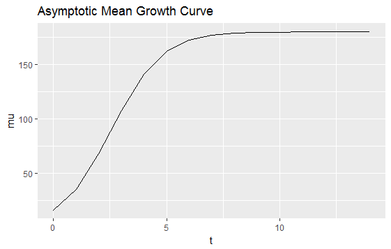
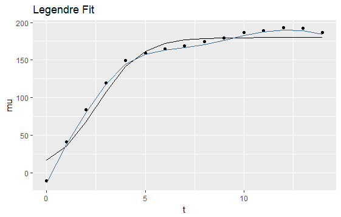

# iForm Functional Mapping (A computational method)


## Motivation

<p> As we have seen and also has been noted by several researchers while conducting biometric analysis (\cite{jinks1982biometrical}; \cite{hill2004ds}; \cite{wu1996detecting}) or molecular dissection (\cite{mackay2009genetics}, \cite{park2010estimation}) is that quantatitve traits are very complex and much is still needed to be learned.  The researchers cited note that the traits are most likely polygenic, including gene-gene interactions and other sources of interaction effects. (\cite{cheverud1995epistasis}; \cite{moore2003ubiquitous}; \cite{van2010detection}; \cite{mackay2014epistasis})  Higher order interactions of complex traits are not well studied because of their difficulty to detect in mapping studies as well.  The lack of data should not be construed as proof that this order of interaction does not exist. (\cite{taylor2015higher}).  The difficulty in detection leads a way for new computational methods to be developed and approaches to describe how to distinguish such effects.  As noted in chapter \@ref(highorder), new theoretical models of high-order epistasis have well been established by mathematical biologists (\cite{hansen2001epistasis}; \cite{beerenwinkel2007analysis}). These models provided a foundation to interpret high-order epistasis from a biological standpoint. A few statistical models have been derived to estimate and test high-order epistasis in case-control designs (\cite{wang2015bayesian}) and population-based mapping settings (\cite{pang2013statistical}) </p>

<p> Growth and developmental traits are mostly better described by a functional process (\cite{hernandez2015understanding}, \cite{muraya2017genetic}), it is more biologically meaningful to map these traits as growth curves (\cite{sun2015mapping}). There have been a few different approaches that have integrated growth equations into genetic mapping via the likelihood function, leading to the birth of a so-called functional mapping models (\cite{ma2002functional}; \cite{wu2006functional}; \cite{li2015dynamic}; \cite{muraya2017genetic}). These style of approaches can allow for the developmental change of genetic control to be characterized across both time and as well as space (\cite{he2010mapping}; \cite{li2010functional}). Treating the phenotype as a complex trait it would be likely it would follow a more functional or dynamic process.  This information could be lost or greatly limited by treating the response as a single static predictor. Modeling the longitudinal structures in this fashion, functional mapping has proven to be of great statistical power in gene identification and the utilization of sparse phenotypic data (\cite{hou2006framework}). In an attempt to capture all relevant information and be as parsimonious as possible principles from biophysical and biochemical processes were considered.  The logistic growth equations are both biologically relevant (\cite{west2001general}; \cite{sun2014model}) and have few parameters that can be mapped to growth QTLs by estimating these parameters for each genotype and interactions between genotypes. </p>

<p> There are many approaches for gene mapping with genome-wide association studies (GWAS) being one of the most popular one, achieving a considerable success since their first publication in 2005 (\cite{klein2005complement}). Analytical approaches are constantly being developed to perform GWAS studies.  There are a few areas of challenges in statistical modeling and analysis of genetic data that account for the complexity of phenotypic information.  Generally GWAS studies associate genetic markers with static, single valued phenotypes.  As we have discussed, most analysis revolve around point wise estimates and do not always take the entirety of the system during the analysis.  Incorporating selections are starting to become more common but further work is this area still needs to be explored.  Extending the forward selecting procedure previously state in \@ref(highdeqtl) and \@ref(highorder) in order to handle a functional phenotype would be very beneficial with GWAS level studies.  A few challenges do arise while considering to conduct a genome-wide association study (GWAS) on interacting traits measured at a sequence of time points. The model needs to be flexible enough to fit different situations, independence of the error structure needs to be maintained or accounted for with the time dependencies and finally computational efficiency needs to be good enough to fit such complex models.  All of these issues combined make it a difficult exertion to take on but with computational power increasing, it is becoming more feasible to handle. </p>

<p> In applications like the scenario described where we have a functional value phenotype and a high dimensional predictor space with dynamically considering interaction effects it may be too restrictive to suppose that the effect
of all of the predictors is captured by a simple linear fit.  Reframing the regression problem to help code in the longitudinal data into the structure of the data in a biologically meaningful manner and making some sparsity assumptions about the number of significant genetic and epistatic effects that affect the phenotype will help in the development of such a model to tackle such a task. </p>


**Also included in iFormFunctional Mapping Part**

Monitoring the change in expression patterns over time provides the distinct possibility of unraveling the mechanistic drivers characterizing cellular responses. Gene arrays measuring the level of mRNA expression of thousands of genes simultaneously provide a method of high-throughput data collection necessary for obtaining the scope of data required for understanding the complexities of living organisms. Unraveling the coherent complex structures of transcriptional dynamics is the goal of a large family of computational methods aiming at upgrading the information content of time-course gene expression data. In this review, we summarize the qualitative characteristics of these approaches, discuss the main challenges that this type of complex data present, and, finally, explore the opportunities in the context of developing mechanistic models of cellular response. \cite{androulakis2007analysis}


## Methods

### Regression by linear combination of  basis functions

<p> One common approach to regression problems is to frame the model as a linear combination of basis functions.  In typical multiple regression the design matrix would be the values of the observed predictors and these would be used to fit the model, usually with a least squares approach.  The goal then being to fit the expected value of the phenotype of interest in terms of the values of the predictors.  This would result in a linear model of the form,

\begin{equation}
\mathbf{Y} = \beta_0 + \beta_1 X_1 + \dots + \beta_p X_p + \epsilon
(\#eq:lin-mod)
\end{equation}

This model is nice for a single response but can be too restrictive at times.  With a functional response over time, having a model with more flexibility could more accurately estimate the phenotype especially when considering a functional phenotype like a growth model.  A fit like the one mentioned would only restrict growth to be a straight line and that may not be applicable in real world applications.  By treating the problem as linear combination of basis functions, the general form would look like,

\begin{equation}
f(x) = \sum_{i=0}^P \theta_i \phi_i(x)
(\#eq:gen-form)
\end{equation}

where the $\phi$ are the basis functions of the researchers choosing.  Under this format you can choose any function that would fit the need of the given problem and has relevance to the application area.  A common choice is to use polynomial regression, where $\phi$ would be the predictors raised to different degrees in order to invoke a non-linear relationship into the model.  This works well but it comes with some draw backs. The first being that for each degree consider, it could grow the predictor set even larger.  Instead of just one effect for each predictor you could have up to the order of the polynomial effects for each predictor.  With the predictor set being at a high dimensional level already, this may not be something feasible to do.  The other area of concern is that it would give a way for higher correlation between effects in the model.  This would violate the initial assumptions of the model.</p>

<p> Standard polynomial regression is just one case of using basis functions in linear regression.  There are many transformations that are able to be performed to invoke nicer properties to the data.  The basis functions that are going to be focused on in this work are orthogonal polynomials.  This would be a special case of polynomial regression that would alleviate some of the drawbacks mentioned above.  Orthogonal polynomials by definition are orthogonal to each other and therefore would not have any correlation between predictors when used as basis functions.  Also as an advantage, polynomial regression can be used to make similar types of interest as other types of multiple regression analysis.  It does this while modeling a non-linear relationship between the phenotype and genetic markers without having to use complex optimization methods.  Ordinary least squares would still apply in this framework, making it more computational efficient as well.  One specific class of orthogonal polynomials that will be used are the Legendre polynomials because of the nice properties they posses. </p>


### Legendre Polynomials

```{r Legendre-fig, fig.cap='First 10 Legendre Polynomials', out.width='80%', fig.asp=.75, fig.align='center', echo = FALSE}
library(ggplot2)
library(data.table)
library(RColorBrewer)

Legendre<-function( t, np.order=1,tmin=NULL, tmax=NULL )
{
  u <- -1
  v <- 1
  if (is.null(tmin)) tmin<-min(t)
  if (is.null(tmax)) tmax<-max(t)
  nt <- length(t)
  ti    <- u + ((v-u)*(t-tmin))/(tmax - tmin)
  np.order.mat <- matrix(rep(0,nt*np.order),nrow=nt)
  if(np.order >=1)
    np.order.mat[,1] <- rep(1,nt)
  if (np.order>=2)
    np.order.mat[,2] <- ti
  if (np.order>=3)
    np.order.mat[,3] <- 0.5*(3*ti*ti-1)
  if (np.order>=4)
    np.order.mat[,4] <- 0.5*(5*ti^3-3*ti)
  if (np.order>=5)
    np.order.mat[,5] <- 0.125*(35*ti^4-30*ti^2+3)
  if (np.order>=6)
    np.order.mat[,6] <- 0.125*(63*ti^5-70*ti^3+15*ti)
  if (np.order>=7)
    np.order.mat[,7] <- (1/16)*(231*ti^6-315*ti^4+105*ti^2-5)
  if (np.order>=8)
    np.order.mat[,8] <- (1/16)*(429*ti^7-693*ti^5+315*ti^3-35*ti)
  if (np.order>=9)
    np.order.mat[,9] <- (1/128)*(6435*ti^8-12012*ti^6+6930*ti^4-1260*ti^2+35)
  if (np.order>=10)
    np.order.mat[,10] <- (1/128)*(12155*ti^9-25740*ti^7+18018*ti^5-4620*ti^3+315*ti)
  if (np.order>=11)
    np.order.mat[,11] <- (1/256)*(46189*ti^10-109395*ti^8+90090*ti^6-30030*ti^4+3465*ti^2-63)
  return(np.order.mat)
}

L <- data.frame(t = seq(0, 1, by = 0.01), Legendre(seq(0, 1, by = 0.01), 10))
L_melt <- melt(L, id = "t")

ggplot(L_melt, aes(x = t, y = value, group = variable, color = brewer.pal(10, "Set3")[variable])) + 
  geom_line() + theme(legend.position="none")


```

The definition of the Legendre polynomials are the solutions for $n = 0, 1, 2, \dots $(with the normalization $P_n(1) = 1$ form a polynomial sequence of orthogonal polynomials called the Legendre polynomials. Each Legendre polynomial $P_n(x)$ is an nth-degree polynomial. It may be expressed using Rodrigues' formula:

\begin{equation}
P_n(x) = \frac{1}{2^nn!} \frac{d^n}{dx^n}[(x^2-1)^n]
(\#eq:rodrigues-formula)
\end{equation}

An important property of the Legendre polynomials is that they are orthogonal with respect to the L2-norm on the interval $−1 \le x \le 1$:

\begin{equation}
\int_1^{-1} P_m(x)P_n(x)dx = \frac{2}{2+1}\delta_{mn}
(\#eq:orthg-leg)
\end{equation}

$\delta_{mn}$ denotes the Kronecker delta equal to 1 if m = n and 0 otherwise.  These polynomials can be generated by using the following recursively.  Each Legendre polynomial would be the next order n in the expression below.  


\begin{equation}
\begin{split}
P_n(x) & = \frac{1}{2^n}\sum_{k=0}^{n}{{n}\choose{k}}^2(x-1)^{n-k}(x+1)^k \\
& = \sum_{k=0}^{n}{{n}\choose{k}}{{-n-1}\choose{k}}{\left(\frac{1-x}{2}\right)}^k \\
& = 2^{-n}\sum_{k=0}^{n} x^k {{n}\choose{k}}{{\frac{n+k+1}{2}}\choose{k}} \\
\end{split}
(\#eq:leg-eq)
\end{equation}

With nature of the Legendre orthogonal polynomials, it was advantages for both dimension reduction and also handling unevenly spaced, missing or non-uniform time measurements from different subjects in the dataset. By seeing which polynomial curve fits the given phenotype, it removes some of the challenges when fitting the model. Different orders of the polynomial are tried throughout the procedure to allow for flexibility in the fitting the genetic variation from the mean curve for each of the genotypes or epistasis between genotypes considered in the model.  


### Model 

The layout of the underlying model is first fit to an asymptotic growth model described by a logistic curve of the form,

$$\mu(t) = a/(1 + b * exp(-r*t))$$

It is biologically meaningful to implement a growth equation, like a logistic curve, to describe growth trajectory \cite{west2001general}. Here the population is described by a mean growth curve by this growth equation where a, b and r are growth parameters each provide a biological interpretation, with a being the asymptotic growth, b being the initial amount of growth and r being the relative growth rate. Time varying additive and dominant effects of significant SNPs are modeled by the Legendre orthogonal polynomial used in quantitative genetic studies, mentioned above.   (\cite{jiang20152higwas}, \cite{olori1999estimating}, \cite{li2010functional}).  This representation can be expressed as

$$ \alpha_j(t) = (L_0(t), L_1(t), ... , L_s(t))*(u_{j0}, u_{j1},...,u_{js})^T $$
$$ \beta_j(t) = (L_0(t), L_1(t), ... , L_{s'}(t))*(v_{j0}, v_{j1},...,v_{js'})^T $$

where $L_0(t), L_1(t), ... , L_s(t)$ and  $L_0(t), L_1(t), ... , L_{s'}(t)$ are the LOP of orders $s$ and $s'$, respectively; and $u_{j0}, u_{j1},...,u_{js}$ and $v_{j0}, v_{j1},...,v_{js'}$ are the vectors of time-invariant additive and dominant effects, respectively. Orders $s$ and $s'$, selected from information criteria, for the purposes of this procedure the Bayesian information criterion ($BIC_2$), originally developed by \cite{chen2008extended} was implemented.  A nice feature that comes from modeling the fit in this manner is that the dimension of response phenotypic data is reduced through LOP modeling. (\cite{li2010functional}, \cite{jiang20152higwas}, \cite{li2010functional}, \cite{ahn2010functional}, \cite{das2011dynamic}).  Writing the model out more explicitly we would have,

\begin{equation}
\begin{split}
y(t) = \mu(t) + \sum_{j=1}^{J}\alpha_j(t)\xi_j + \sum_{k=1}^{K}\beta_k(t)\zeta_k \\ 
&+ \sum_{I_1<I_2=1}^{I}\gamma_I^{aa}(t) \xi_{I_1}\xi_{I_2} \\ 
&+ \sum_{I_1<I_2=1}^{I}\gamma_I^{ad}(t) \xi_{I_1}\zeta_{I_2} \\
&+ \sum_{I_1<I_2=1}^{I} \gamma_I^{da}(t) \zeta_{I_1}\xi_{I_2} \\
&+ \sum_{I_1<I_2=1}^{I} \gamma_I^{dd}(t)\zeta_{I_1}\zeta_{I_2} \\ 
&+ \epsilon(t)
\end{split}
(\#eq:epi-legendre)
\end{equation}


### Integrating with the iForm Procedure

<p> An outline of the selection procedure used following the model described is as follows.  At first the mean growth curve is estimated for the presented data following the logistic growth curve.  This could be adjusted depending on the functional process the researcher is studying.  Once the mean curve is fit the selection procedure is initialized in a similar fashion as mentioned in previous chapters \@ref{highdeqtl}.  Both the solution set and the model set are assigned to the empty set, $S_0=\emptyset$ and $M_0=\emptyset$. The candidate set starts off containing all main effects for the additive and dominant effects of each SNP.  The selection procedure then begins and each SNP is assessed and the best fitting candidate is then placed in the selection set.  While assessing each candidate SNP, an additional search is performed for the best fitting polynomial fit up to a pre-specified order that is determined at the beginning of the procedure.  The orthogonal polynomials are used to assist in fitting the genetic effects for each marker or epistatic interaction between the markers. This would allow the genetic effect some flexibility over time and give a more representative fit. This could also be used with other functional models or other types of non-linear functions that characterizes the biological systems being evaluated. We are treating the polynomials as a basis function for the regression problem and therefore the Residual Sum of Squares is calculated similar to multiple regression but replacing the design matrix with the necessary basis functions.  This continues until a designated stopping value is reached.  The $BIC_2$ is then used to find the optimal fit given the selection procedure performed.  The following graphics show how the process works at each step </p>


```{r growth-example, fig.cap='Example Growth Curve', out.width='80%', fig.asp=.75, fig.align='center', echo = FALSE}

```

```{r growth-exampledata, fig.cap='Example Data with Growth Cruve', out.width='80%', fig.asp=.75, fig.align='center', echo = FALSE}
knitr::include_graphics("images/ExampleDataGrowthCurve.png")
```

```{r legendre-fit, fig.cap='Additional Legendre Fit to Data', out.width='80%', fig.asp=.75, fig.align='center', echo = FALSE}

```


## Application

### Simulation Studies

As statistical issues become more complex they are going to be more analytically intractable and computational methods will need to close that gap to show the effectiveness of new models and procedures.Simulation studies were performed to ascertain the validity of the model.  Rates at which correct markers/epistasis were selected and overall model true model size was assessed. Data was original generated from a mean curve following the growth equation described above. It was then sampled from a multivariate normal distribution with the mean vector following the generated and with correlated errors over time. Significant effects were also included in the model to simulate different marker levels.  These effects could be main effects of SNPs, or epistatic effects of interaction between SNPs.  There were a total of 4 main effects and three interaction effects simulated.  This simulation was replicated 100 times and then the selection procedure was ran.  It performed well with 93% of the replicates selecting all main and interaction effects and the other 7% of the models select a majority of the effects.  The model size simulated was of size 7.  The average model size of the replicates fit was around 13.5.  This would indicate some slight over-fitting but all important effects were included in the model.  Some considerations for this need to be looked into further for future work.  


### Worked Example

As a comparison to what was done before in \@ref(highorder) the same mei tree dataset used in this chapter was studied again.  This serves as a comparison to previous performance and also to see if any new discoveries can be made by incorporating the time component and fitting the growth parameters simultaneously throughout the procedure.  The previous model only fit one parameter of the growth equation as a time and assessed the genetic markers that had a significant impact of this parameter.  The parameter focused on was the rate parameter,r for the shoot height of the progeny.  The initial results running the analysis with a single predictor and using the selection procedure are,

<!-- \begin{center}  -->
<!-- \includegraphics[width=8in]{EpistasisDetection_HTGrowthRate.pdf}  -->
<!-- \end{center} -->

As a comparison here are the results for simultaneously fitting the growth curve and allowing for a more flexible genetic effect to be fit to the data.  As you can see there are overlapping markers identified in the models.  This shows the robustness of the new selection technique to be consistent with previous models.  You can also see that the fit of the overall model has also increased.  By including all effects at once, you gain more statistical power and it boost the adjusted R square value from 0.71 to above 0.9.  This boost in model performance could be partially due to some over-fitting like we observed in the simulation studies and therefore a very strict bonferroni correction was implemented to assess whether individual markers were truly significant.  Even with a strict cut-off we still observed 3 epistatic predictors to be highly significant.  This shows the importance of including such terms while performing such a GWAS.  The other area to note is the highly significant intercept term, which in our case is the result of the growth curve fit before implementing the selection procedure.  This indicates also the importance of including biologically relevant information in the model to help better understand the genetic architecture being studied of the phenotype.  

<!-- \begin{center}  -->
<!-- \includegraphics[width=8in]{HT_ResultsTable.pdf}  -->
<!-- \end{center} -->


## Discussion

The new model proposed has some very nice features and seems to perform well in the given application.  Considering the complexity of working high dimensional data coupled with including epsitatic effects as well as a functional component to the phenotype, it performs relatively efficiently.  **Using generalize least squares, GLS type calculations aided in this efficiecy**, while taking into account the correlation that would naturally arise between the repeated measurements are the same trees over time.  This was enabled by the framing of the regression problem as a linear combination of basis functions. The agreeable properties of orthogonal polynomials helped ensure model assumptions are being met as closely as possible in order to use the calculations.  Also by including the biologically meaningful logistic growth equations it helps fit a baseline fit to the data and would better allow for individual genetic effects to be found throughout the selection. These would of course have to be lab verified in order to assess the true biological mechanisms at play for the genetic control of the phenotype.  

Some possible areas of concern for fitting the genetic effects to the polynomials could be that the effect does not conform to the polynomial curve under consideration.  This can be alleviated by using other types of basis functions such as splines, but this would also cost a huge amount in computational efficiency with such a high dimensional data set.  You need to be as efficient as possible when implementing a GWAS style study with the inclusion of possible epistasis.  False positives could be of concern as well throughout the selection.  The flexibility of the model and the wide range of polynomial fits that are considered could result in artifacts in the data to be picked up on.  This is partially alleviated by using improved selection criteria like the $BIC_2$ and also having stricter than conventional cut-off values for significance testing.  However these would still need to be assessed further through computational techniques such as cross-validation and bootstrapping.  The selection procedure is effective as a screening tool for exploratory data analysis and hypothesis generation.  Lab verification would be another area that would help validate the findings even further.  The comparison to previously run models is promising step in assessing the validity of the model at hand.  


